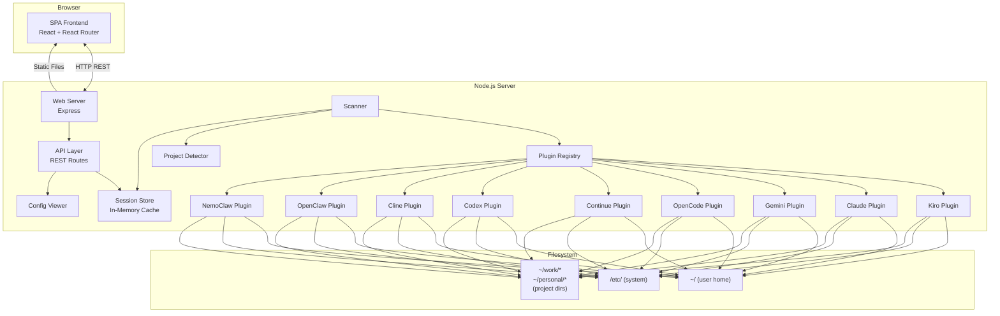
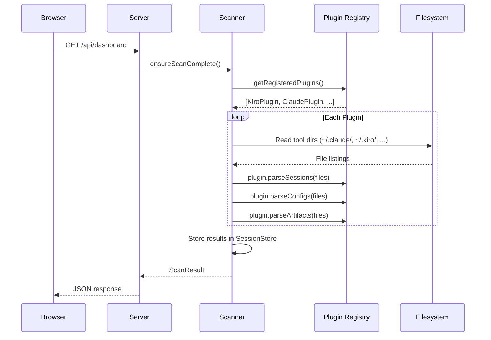
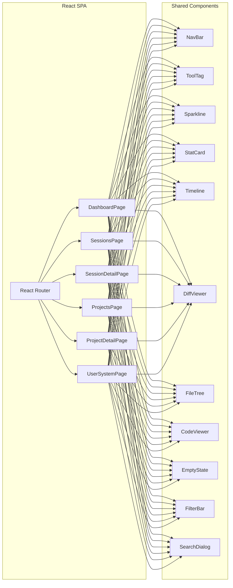

# Design Document: Agents Pulse

## Overview

Agents Pulse is a local web application that gives developers a unified view of all AI coding tool activity on their machine. It scans the filesystem for configuration files, session data, and project-level artifacts across 9+ AI tools (Kiro, Claude Code, Gemini, OpenCode, Continue, Codex, Cline, OpenClaw, NemoClaw), then presents them through a browser-based SPA backed by a Node.js/TypeScript server.

The system is structured as a monorepo with two main packages: a backend HTTP server that performs filesystem scanning, plugin-based parsing, and exposes a REST API; and a frontend SPA that renders Dashboard, Sessions, Session Detail, Projects, Project Detail, and User & System pages.

Key design drivers:
- Plugin-based architecture so new AI tools can be added without modifying core code
- Autodiscovery of plugins via config directory presence AND command-in-PATH detection
- Read-only filesystem access — the app never writes to tool directories
- Local-only operation — no cloud, no auth, no remote data
- Near-real-time session detection via polling-based rescans

## Architecture



### High-Level Data Flow



### Startup Sequence

1. Server reads `~/.agentspulse/config.json` (or defaults) for port, project roots, scan interval
2. Plugin Registry initializes — autodiscovers plugins by checking config dirs + PATH commands
3. Scanner performs initial full scan
4. Express server starts, serves static SPA bundle + REST API
5. Server logs `AgentsPulse running at http://localhost:{port}` to stdout

## Components and Interfaces

### Web Server (`WebServer`)

Responsibilities: Bind to configured port, serve static SPA files, mount API routes, handle graceful shutdown.

```typescript
interface WebServerConfig {
  port: number;           // default: 4040
  host: string;           // default: "127.0.0.1"
  staticDir: string;      // path to built SPA assets
}

class WebServer {
  constructor(config: WebServerConfig, apiRouter: Router);
  start(): Promise<void>;   // binds port, throws on conflict
  stop(): Promise<void>;    // graceful shutdown
}
```

Port conflict detection: On `EADDRINUSE`, log the conflict and `process.exit(1)`.

### Plugin Interface (`ToolPlugin`)

Every AI tool plugin implements this interface. This is the core extensibility point.

```typescript
interface ToolPlugin {
  /** Unique tool identifier, e.g. "claude", "kiro" */
  readonly id: ToolId;

  /** Human-readable display name, e.g. "Claude Code" */
  readonly displayName: string;

  /** Tool-specific brand color hex, e.g. "#b8693a" */
  readonly color: string;

  /** How this plugin was detected */
  readonly detectionMethod: "config" | "command" | "both";

  /** Artifact categories this plugin supports */
  readonly artifactCategories: ArtifactCategory[];

  /** Config directory names to look for at home/project level */
  readonly configDirNames: string[];        // e.g. [".claude"]

  /** Command names to check in PATH */
  readonly commandNames: string[];          // e.g. ["claude"]

  /** System-level config paths */
  readonly systemPaths: string[];           // e.g. ["/etc/claude/"]

  /** Check if this plugin is available on the current system */
  detect(): Promise<DetectionResult>;

  /** Discover config files at a given scope */
  discoverConfigs(scope: ScanScope): Promise<ConfigFile[]>;

  /** Discover all tool artifacts at a given scope */
  discoverArtifacts(scope: ScanScope): Promise<ToolArtifact[]>;

  /** Parse session data from tool-specific files */
  parseSessions(projectPath: string): Promise<Session[]>;

  /** Extract session metadata from a raw session file */
  parseSessionFile(filePath: string): Promise<Session | null>;
}
```

### Plugin Registry (`PluginRegistry`)

Manages plugin lifecycle: registration, autodiscovery, and dispatch.

```typescript
class PluginRegistry {
  private plugins: Map<ToolId, ToolPlugin>;

  /** Register a plugin manually */
  register(plugin: ToolPlugin): void;

  /** Autodiscover plugins by checking config dirs + PATH */
  async autodiscover(): Promise<void>;

  /** Get all registered (detected) plugins */
  getPlugins(): ToolPlugin[];

  /** Get a specific plugin by tool ID */
  getPlugin(id: ToolId): ToolPlugin | undefined;

  /** Get count of detected tools */
  getDetectedCount(): number;
}
```

Autodiscovery algorithm:
1. For each known plugin class, instantiate it
2. Call `plugin.detect()` which checks:
   a. Does `~/{configDirName}` exist? → config-based detection
   b. Is `{commandName}` in PATH? → command-based detection (via `which` / `where`)
3. If either check passes, register the plugin with the appropriate `detectionMethod`

### Scanner (`Scanner`)

Orchestrates filesystem scanning across all plugins and scopes.

```typescript
interface ScanScope {
  level: "user-home" | "system" | "project";
  basePath: string;       // e.g. "~/" or "/etc/" or "~/work/api-gateway"
}

interface ScanResult {
  sessions: Session[];
  projects: Project[];
  configs: ConfigFile[];
  artifacts: ToolArtifact[];
  errors: ScanError[];
  scannedAt: Date;
  durationMs: number;
}

class Scanner {
  constructor(
    private registry: PluginRegistry,
    private store: SessionStore,
    private projectRoots: string[]   // configured dirs to scan for projects
  );

  /** Full scan across all scopes */
  async fullScan(): Promise<ScanResult>;

  /** Scan only user-home and system configs */
  async scanUserSystem(): Promise<ScanResult>;

  /** Scan a single project directory */
  async scanProject(path: string): Promise<ScanResult>;
}
```

Permission handling: When `fs.access` fails with `EACCES`, the scanner logs a warning and skips the directory. Errors are collected in `ScanResult.errors` but never halt the scan.

### Session Store (`SessionStore`)

In-memory cache of all parsed data. Provides query methods for the API layer.

```typescript
class SessionStore {
  /** Replace all data from a scan result */
  update(result: ScanResult): void;

  /** Query sessions with filters */
  getSessions(filter: SessionFilter): Session[];

  /** Get a single session by ID */
  getSession(id: string): Session | null;

  /** Get all projects */
  getProjects(): Project[];

  /** Get a single project by path or name */
  getProject(identifier: string): Project | null;

  /** Get configs by scope */
  getConfigs(scope?: "user-home" | "system"): ConfigFile[];

  /** Get artifacts, optionally filtered */
  getArtifacts(filter?: ArtifactFilter): ToolArtifact[];

  /** Dashboard aggregate stats */
  getDashboardStats(): DashboardStats;

  /** Last scan timestamp */
  getLastScanTime(): Date | null;
}
```

### Project Detector (`ProjectDetector`)

Identifies project directories and extracts metadata.

```typescript
class ProjectDetector {
  constructor(private registry: PluginRegistry);

  /** Scan a directory tree for projects */
  async detectProjects(roots: string[]): Promise<Project[]>;

  /** Check if a single directory is a project */
  async isProject(dirPath: string): Promise<boolean>;

  /** Extract git metadata from a project */
  async extractGitInfo(projectPath: string): Promise<GitInfo | null>;

  /** Extract dependencies from package.json */
  async extractDependencies(projectPath: string): Promise<Dependency[]>;
}
```

Detection: Walks each root directory (non-recursive into nested projects). For each child directory, checks if any registered plugin's `configDirNames` exist as subdirectories. If yes, it's a project.

### Config Viewer (`ConfigViewer`)

Reads and returns file contents for display.

```typescript
class ConfigViewer {
  /** Read a file and return its contents with metadata */
  async readFile(filePath: string): Promise<FileViewResult>;
}

interface FileViewResult {
  path: string;
  content: string;
  size: number;
  lastModified: Date;
  fileType: "json" | "yaml" | "toml" | "markdown" | "other";
  readable: boolean;
  error?: string;
}
```

### API Layer (REST Routes)

All endpoints are prefixed with `/api`. Responses are JSON.

```
GET  /api/dashboard              → DashboardResponse
GET  /api/sessions               → SessionListResponse     (query: tool, status, dateRange, projectId, page, limit)
GET  /api/sessions/:id           → SessionDetailResponse
GET  /api/projects               → ProjectListResponse
GET  /api/projects/:id           → ProjectDetailResponse
GET  /api/configs                → ConfigListResponse       (query: scope, fileType, tool)
GET  /api/configs/view           → FileViewResponse         (query: path)
GET  /api/artifacts              → ArtifactListResponse     (query: tool, category, scope)
GET  /api/artifacts/view         → FileViewResponse         (query: path)
POST /api/rescan                 → RescanResponse
GET  /api/tools                  → ToolListResponse
GET  /api/search                 → SearchResponse           (query: q)
```

#### Endpoint Details

**`GET /api/dashboard`**
Returns aggregate stats, active sessions, recent projects, and tool summaries.
```typescript
interface DashboardResponse {
  stats: {
    activeSessions: number;
    sessionsThisWeek: number;
    projectsTouched: number;
    toolsDetected: number;
  };
  activeSessions: SessionSummary[];
  recentProjects: ProjectSummary[];
  toolSummaries: ToolSummary[];
  lastScanAt: string;
}
```

**`GET /api/sessions`**
Paginated, filterable session list.
```typescript
interface SessionListResponse {
  sessions: SessionSummary[];
  total: number;
  page: number;
  limit: number;
  filters: {
    tool?: ToolId;
    status?: SessionStatus;
    dateRange?: "today" | "7d" | "30d" | "all";
    projectId?: string;
  };
}
```

**`GET /api/sessions/:id`**
Full session detail including timeline events.
```typescript
interface SessionDetailResponse {
  session: Session;          // full session with events timeline
  files: FileChange[];       // files modified with diffs
  config: SessionConfig;     // config used for the session
  sourceFiles: string[];     // raw session file paths on disk
}
```

**`GET /api/projects/:id`**
Full project detail.
```typescript
interface ProjectDetailResponse {
  project: Project;
  stats: ProjectStats;
  sessions: SessionSummary[];
  toolBreakdown: ToolBreakdownEntry[];
  artifacts: ToolArtifact[];
  gitInfo: GitInfo | null;
  dependencies: Dependency[];
  activitySparkline: number[];   // 30 data points, sessions/day
}
```

**`POST /api/rescan`**
Triggers a full filesystem rescan. Returns when complete.
```typescript
interface RescanResponse {
  success: boolean;
  scannedAt: string;
  durationMs: number;
  errors: ScanError[];
}
```

### Frontend Architecture

The frontend is a React SPA using React Router for client-side routing. It is built with Vite and served as static files by the Express backend.



#### Routes

| Path | Component | Description |
|------|-----------|-------------|
| `/` | `DashboardPage` | Overview with stats, active sessions, recent projects |
| `/sessions` | `SessionsPage` | All sessions with filters and view modes |
| `/sessions/:id` | `SessionDetailPage` | Single session timeline, diffs, metadata |
| `/projects` | `ProjectsPage` | All projects with view modes |
| `/projects/:id` | `ProjectDetailPage` | Single project overview, sessions, configs |
| `/user` | `UserSystemPage` | User-home and system config browser |

#### Shared Components

- **`NavBar`** — Persistent top bar with logo, page links, active page indicator, live session count badge, global search trigger (Cmd+K). Matches wireframe topbar layout.
- **`ToolTag`** — Inline label with colored square and tool name. Color map defined in a shared constant matching Requirement 15.
- **`Sparkline`** — Compact bar chart rendered as flex container with proportional-height spans. Pure CSS, no charting library.
- **`StatCard`** — Metric display: large number, label, optional sub-label.
- **`Timeline`** — Chronological event list with left-border line and typed dot indicators (prompt=filled, edit=yellow, error=red).
- **`DiffViewer`** — Unified diff renderer with line numbers, green add lines, red delete lines.
- **`FileTree`** — Collapsible tree with caret toggles, file/dir icons, tool badges.
- **`CodeViewer`** — Preformatted code block with file metadata header (path, type, size, date). Used by Config Viewer.
- **`EmptyState`** — Dashed-border placeholder with message and optional guidance text.
- **`FilterBar`** — Chip-based filter row for tool, status, date range selection.
- **`SearchDialog`** — Modal search overlay triggered by Cmd+K, searches across sessions, projects, and configs.

#### State Management

The frontend uses React Query (TanStack Query) for server state:
- Automatic caching and background refetching
- Stale-while-revalidate for near-real-time feel
- Dashboard auto-refetches every 5 seconds (matching wireframe "auto-refresh 5s" label)
- Rescan mutation invalidates all queries on success

Local UI state (active filters, selected view mode, expanded tree nodes) is managed with React `useState` / `useReducer` and persisted to `localStorage` for view mode preferences.


## Data Models

### Core Types

```typescript
/** Tool identifiers — one per supported AI tool */
type ToolId =
  | "kiro"
  | "claude"
  | "gemini"
  | "opencode"
  | "continue"
  | "codex"
  | "cline"
  | "openclaw"
  | "nemoclaw";

/** Tool brand colors (Requirement 15) */
const TOOL_COLORS: Record<ToolId, string> = {
  claude:   "#b8693a",
  kiro:     "#3a6b8a",
  gemini:   "#6a5a8a",
  opencode: "#3a8a6a",
  continue: "#8a3a6a",
  codex:    "#5a5a5a",
  cline:    "#8a6a3a",
  openclaw: "#3a3a8a",
  nemoclaw: "#8a3a3a",
};

type SessionStatus = "active" | "done" | "error" | "archived";

/** Artifact categories — common set plus plugin-extensible */
type ArtifactCategory =
  | "config"
  | "hooks"
  | "triggers"
  | "agents"
  | "mcps"
  | "steering"
  | "memory"
  | string;   // plugin-specific categories

/** Human-readable labels for artifact categories (Requirement 17.7) */
const ARTIFACT_CATEGORY_LABELS: Record<string, string> = {
  config:   "Config Files",
  hooks:    "Hooks",
  triggers: "Triggers",
  agents:   "Agents",
  mcps:     "MCP Servers",
  steering: "Steering / Rules",
  memory:   "Memory Files",
};
```

### Session

```typescript
interface Session {
  id: string;                    // unique session identifier
  toolId: ToolId;                // which AI tool
  title: string;                 // session title or summary
  status: SessionStatus;
  projectPath: string;           // absolute path to project dir
  projectName: string;           // derived from dir name
  startedAt: Date;
  endedAt?: Date;
  durationMs: number;
  model: string;                 // e.g. "sonnet-4.5"
  tokens: {
    used: number;
    limit: number;
  };
  estimatedCost: number;         // USD
  messageCount: number;
  toolCallCount: number;
  filesModified: FileChange[];
  netLines: {
    additions: number;
    deletions: number;
  };
  events: SessionEvent[];        // chronological timeline
  sourceFiles: string[];         // raw file paths on disk
  config: SessionConfig;         // config used for this session
}

interface SessionSummary {
  id: string;
  toolId: ToolId;
  title: string;
  status: SessionStatus;
  projectPath: string;
  projectName: string;
  startedAt: Date;
  durationMs: number;
  tokens: number;                // just the used count
  lastPrompt?: string;           // truncated first user prompt
}

interface SessionConfig {
  model: string;
  maxTokens?: number;
  tools: string[];               // enabled tool names
  systemPrompt?: string;         // path to system prompt file
  agent?: string;                // agent definition file path
  mcpServers?: string[];         // MCP server names
}
```

### Session Events (Timeline)

```typescript
type SessionEvent =
  | UserPromptEvent
  | AssistantResponseEvent
  | ToolCallEvent
  | FileEditEvent
  | ErrorEvent;

interface BaseEvent {
  timestamp: Date;
  type: string;
}

interface UserPromptEvent extends BaseEvent {
  type: "user_prompt";
  text: string;
}

interface AssistantResponseEvent extends BaseEvent {
  type: "assistant_response";
  text: string;
}

interface ToolCallEvent extends BaseEvent {
  type: "tool_call";
  toolName: string;              // "Read", "Grep", "Bash", "Write", "Edit", etc.
  input: string;                 // e.g. file path or command
  output?: string;               // result summary
  success: boolean;
}

interface FileEditEvent extends BaseEvent {
  type: "file_edit";
  filePath: string;
  additions: number;
  deletions: number;
  isNewFile: boolean;
  diff?: string;                 // unified diff content
}

interface ErrorEvent extends BaseEvent {
  type: "error";
  message: string;
  details?: string;
}
```

### File Change

```typescript
interface FileChange {
  filePath: string;              // relative to project root
  additions: number;
  deletions: number;
  isNewFile: boolean;
}
```

### Project

```typescript
interface Project {
  id: string;                    // derived from path hash
  name: string;                  // directory name
  path: string;                  // absolute filesystem path
  tools: ToolId[];               // detected AI tools
  sessionCount: number;
  sessionsThisWeek: number;
  totalTokens: number;
  estimatedCost: number;
  netLines: {
    additions: number;
    deletions: number;
  };
  lastActivityAt: Date;
  isActive: boolean;             // has running sessions
  activitySparkline: number[];   // 7 or 30 data points
  gitInfo: GitInfo | null;
  dependencies: Dependency[];
  artifacts: ToolArtifact[];
}

interface ProjectSummary {
  id: string;
  name: string;
  path: string;
  tools: ToolId[];
  sessionCount: number;
  lastActivityAt: Date;
  isActive: boolean;
}

interface GitInfo {
  branch: string;
  lastCommitMessage: string;
  lastCommitAt: Date;
  uncommittedCount: number;
  ahead: number;
  behind: number;
}

interface Dependency {
  name: string;
  version: string;
}
```

### Config File

```typescript
interface ConfigFile {
  path: string;                  // absolute path
  toolId: ToolId | "shared";    // owning tool or "shared" for system-wide
  scope: "user-home" | "system" | "project";
  fileType: "json" | "yaml" | "toml" | "markdown" | "other";
  size: number;                  // bytes
  lastModified: Date;
}
```

### Tool Artifact

```typescript
interface ToolArtifact {
  path: string;                  // absolute path
  toolId: ToolId;
  category: ArtifactCategory;
  scope: "user-home" | "system" | "project";
  projectPath?: string;          // if scope is "project"
  fileType: "json" | "yaml" | "toml" | "markdown" | "other";
  size: number;
  lastModified: Date;
}
```

### Dashboard Stats

```typescript
interface DashboardStats {
  activeSessions: number;
  sessionsThisWeek: number;
  projectsTouched: number;
  toolsDetected: number;
}

interface ToolSummary {
  toolId: ToolId;
  displayName: string;
  color: string;
  homePath: string;              // e.g. "~/.claude"
  fileCount: number;
  detectionMethod: "config" | "command" | "both";
}

interface ToolBreakdownEntry {
  toolId: ToolId;
  displayName: string;
  sessionCount: number;
  proportion: number;            // 0-1, for bar chart width
}
```

### Scan Error

```typescript
interface ScanError {
  path: string;
  pluginId?: ToolId;
  message: string;
  code: "EACCES" | "ENOENT" | "PARSE_ERROR" | "UNKNOWN";
}
```

### Detection Result

```typescript
interface DetectionResult {
  detected: boolean;
  method: "config" | "command" | "both" | "none";
  configPaths: string[];         // found config directories
  commandPath?: string;          // resolved command path from which/where
}
```

### Session Filter

```typescript
interface SessionFilter {
  tool?: ToolId;
  status?: SessionStatus;
  dateRange?: "today" | "7d" | "30d" | "all";
  projectId?: string;
  search?: string;
  page?: number;
  limit?: number;
  sortBy?: "startedAt" | "title" | "tokens" | "duration";
  sortOrder?: "asc" | "desc";
}
```

### Artifact Filter

```typescript
interface ArtifactFilter {
  tool?: ToolId;
  category?: ArtifactCategory;
  scope?: "user-home" | "system" | "project";
  projectPath?: string;
}
```

### Application Config

```typescript
interface AppConfig {
  port: number;                  // default: 4040
  host: string;                  // default: "127.0.0.1"
  projectRoots: string[];       // directories to scan for projects, e.g. ["~/work", "~/personal"]
  scanIntervalMs: number;       // auto-rescan interval, default: 0 (disabled)
  configPath: string;           // path to this config file
}
```

Config is loaded from `~/.agentspulse/config.json` if it exists, otherwise defaults are used. CLI flags override config file values.

### Plugin Definitions (Per-Tool)

Each plugin knows its tool's filesystem conventions. Here is the mapping:

| Tool | Config Dir | Home Path | Command | Session Format | Key Files |
|------|-----------|-----------|---------|---------------|-----------|
| Kiro | `.kiro/` | `~/.kiro/` | `kiro` | Proprietary | `config.yaml`, `steering.md`, `hooks.json`, `specs/` |
| Claude Code | `.claude/` | `~/.claude/` | `claude` | JSONL | `settings.json`, `CLAUDE.md`, `mcp.json`, `agents/` |
| Gemini | `.gemini/` | `~/.gemini/` | `gemini` | JSON | `settings.json`, `GEMINI.md` |
| OpenCode | `.opencode/` | `~/.opencode/` | `opencode` | YAML/JSON | `config.json`, `agents/` |
| Continue | `.continue/` | `~/.continue/` | `continue` | JSON | `config.json`, `prompts/`, `rules.md` |
| Codex | `.codex/` | `~/.codex/` | `codex` | TOML/JSON | `config.toml`, `instructions.md` |
| Cline | `.cline/` | `~/.cline/` | `cline` | JSON | `settings.json` |
| OpenClaw | `.openclaw/` | `~/.openclaw/` | `openclaw` | YAML | `config.yaml`, `profiles/` |
| NemoClaw | `.nemoclaw/` | `~/.nemoclaw/` | `nemoclaw` | JSON | `config.json` |


## Correctness Properties

*A property is a characteristic or behavior that should hold true across all valid executions of a system — essentially, a formal statement about what the system should do. Properties serve as the bridge between human-readable specifications and machine-verifiable correctness guarantees.*

### Property 1: Scanner dispatches to all registered plugins

*For any* set of plugins registered in the Plugin Registry, when the Scanner performs a scan, every registered plugin SHALL receive a scan invocation — no plugin is skipped and no unregistered plugin is called.

**Validates: Requirements 2.2, 2.4, 3.4**

### Property 2: Plugin autodiscovery matches filesystem and PATH state

*For any* combination of tool config directories existing on the filesystem and tool commands present in the system PATH, the Plugin Registry's autodiscovery SHALL detect exactly the tools whose config directory exists OR whose command is in PATH, and each detected plugin SHALL report its detection method as "config" (config only), "command" (command only), or "both" (both present).

**Validates: Requirements 2.5, 2.6, 2.7**

### Property 3: Scan results round-trip through Session Store

*For any* valid ScanResult produced by the Scanner, storing it in the Session Store and then querying back all sessions, projects, configs, and artifacts SHALL produce data equivalent to the original ScanResult.

**Validates: Requirements 3.6**

### Property 4: Session filtering is correct and complete

*For any* list of sessions and any combination of filters (tool, status, date range), the filtered result SHALL contain exactly the sessions that match ALL active filter criteria — no matching session is omitted and no non-matching session is included. With no filters active, all sessions are returned.

**Validates: Requirements 5.1, 5.2, 5.3, 5.4**

### Property 5: Session grouping preserves all sessions

*For any* list of sessions, grouping by project (for the "grouped by project" view) SHALL produce groups where: (a) every session appears in exactly one group, (b) each group contains only sessions from that project, and (c) the total count across all groups equals the original session count. The same invariant holds for kanban grouping by status.

**Validates: Requirements 5.5, 5.7**

### Property 6: Session sorting is stable and correct

*For any* list of sessions and any sort column (startedAt, title, tokens, duration) with any sort order (asc, desc), the flat table view SHALL display sessions in an order consistent with the sort criteria — for any two adjacent sessions, the first is ≤ (or ≥) the second on the sort key.

**Validates: Requirements 5.6**

### Property 7: Session detail renders all required metadata

*For any* valid Session object, the Session Detail page SHALL render: the session title, status indicator, tool name with Tool_Tag, model name, project path, start timestamp, total tokens, estimated cost, duration, message count, tool call count, files modified count, net lines (additions and deletions), and a list of all modified files with their line change counts.

**Validates: Requirements 6.1, 6.3, 6.4**

### Property 8: Timeline events are chronologically ordered

*For any* list of session events with timestamps, the Timeline component SHALL render them in ascending chronological order — for any two adjacent rendered events, the first has a timestamp ≤ the second.

**Validates: Requirements 6.2**

### Property 9: Session JSON export round-trip

*For any* valid Session object, exporting it to JSON via the "Export JSON" action and then parsing the JSON back SHALL produce a Session object equivalent to the original.

**Validates: Requirements 6.8, 11.3**

### Property 10: Session parsing extracts all required fields

*For any* valid session file in a tool's native format, the corresponding plugin's `parseSessionFile` SHALL produce a Session object containing all required fields: id, title, status, startedAt, durationMs, model, tokens, estimatedCost, messageCount, toolCallCount, filesModified, netLines, and events. For any malformed session file, parsing SHALL return null without throwing.

**Validates: Requirements 11.1, 11.2**

### Property 11: Config file metadata extraction matches filesystem

*For any* file on disk with known properties, the plugin's config extraction SHALL produce a ConfigFile with path, size, lastModified, and fileType that match the actual filesystem metadata, and the toolId matching the plugin that discovered it.

**Validates: Requirements 12.1**

### Property 12: Project detection identifies directories with tool markers

*For any* directory containing at least one AI tool marker subdirectory (from the set `.claude/`, `.kiro/`, `.gemini/`, `.opencode/`, `.continue/`, `.codex/`, `.cline/`, `.openclaw/`, `.nemoclaw/`), the Project Detector SHALL identify it as a project and record the correct path, name (derived from directory name), and the complete list of detected tools. For any directory containing none of these markers, it SHALL NOT be identified as a project.

**Validates: Requirements 13.1, 13.2**

### Property 13: Package.json dependency extraction

*For any* valid `package.json` file containing a `dependencies` and/or `devDependencies` object, the Project Detector SHALL extract a dependency list where each entry has the correct package name and version string, and the total count matches the number of entries in the source file.

**Validates: Requirements 13.3**

### Property 14: Tool visual identity mapping is consistent

*For any* ToolId, the rendered Tool_Tag SHALL use the color from the TOOL_COLORS constant (claude=#b8693a, kiro=#3a6b8a, etc.), and *for any* SessionStatus, the status indicator SHALL use the correct color (active=green #2f6b3a with pulse, done=dark gray, error=red #8a2a2a, idle=gray). *For any* ArtifactCategory from the common set, the displayed label SHALL match the ARTIFACT_CATEGORY_LABELS map.

**Validates: Requirements 15.1, 15.5, 17.7**

### Property 15: Artifact discovery covers all declared categories

*For any* plugin with declared artifact categories and a filesystem containing matching files, scanning SHALL return at least one ToolArtifact for each category that has files present, and every returned artifact SHALL have a category that is in the plugin's declared categories. Artifacts SHALL be correctly grouped by category when displayed on the User & System page and Project Detail page.

**Validates: Requirements 17.3, 17.4, 17.5**

### Property 16: Config filtering by scope and file type

*For any* list of config files and any combination of scope filter (user-home, system) and file type filter (json, yaml/toml, markdown), the filtered result SHALL contain exactly the files matching all active filter criteria.

**Validates: Requirements 9.6**

### Property 17: Dashboard shows correct top-5 recent projects

*For any* list of projects with varying `lastActivityAt` timestamps, the Dashboard's recent projects section SHALL display exactly the 5 projects with the most recent `lastActivityAt` values, in descending order. If fewer than 5 projects exist, all are shown.

**Validates: Requirements 4.5**

### Property 18: Project filesystem tree groups by parent directory

*For any* list of projects with filesystem paths, the "filesystem tree" view SHALL group projects under their common parent directories, with each project appearing exactly once in the tree and under its correct parent.

**Validates: Requirements 7.3**


## Error Handling

### Backend Errors

| Error Scenario | Handling Strategy | User Impact |
|---|---|---|
| Port already in use (EADDRINUSE) | Log error with port number, exit with code 1 | Server fails to start, user sees error in terminal |
| Directory permission denied (EACCES) | Log warning, skip directory, continue scan | Missing data from unreadable dirs, scan completes |
| Session file parse failure | Log warning with file path and error, skip file, continue | Missing session, other sessions unaffected |
| Config file unreadable | Return `FileViewResult` with `readable: false` and error message | Config Viewer shows "File not readable" message |
| Plugin detection failure | Log warning, mark plugin as not detected, continue | Tool not shown in UI, other tools unaffected |
| Git command failure | Return `null` for GitInfo, log warning | Git section shows "No git info available" |
| package.json parse failure | Return empty dependency list, log warning | Dependencies section empty |
| Filesystem watcher error | Log error, fall back to manual rescan only | Auto-refresh disabled, manual rescan still works |

### Frontend Errors

| Error Scenario | Handling Strategy | User Impact |
|---|---|---|
| API request failure (network) | React Query retry (3 attempts), then show error state | Temporary "Connection error" banner, auto-retry |
| API returns 404 (session/project not found) | Navigate to parent list page with toast notification | "Session not found" message, redirected to list |
| API returns 500 | Show error state with "Rescan" action | Error message with retry option |
| Rescan timeout (>30s) | Cancel request, show timeout message | "Scan took too long" with retry option |
| Empty data states | Show contextual empty state components (Req 16) | Helpful messages guiding user to take action |
| Search returns no results | Show "No results" with suggestion to broaden search | Clear feedback |

### Error Propagation

- Backend errors are collected in `ScanResult.errors` and returned to the frontend via the API
- The frontend displays a non-blocking error summary if `errors.length > 0` after a scan
- Individual plugin failures never halt the overall scan — the system degrades gracefully
- File read errors in the Config Viewer are displayed inline where the file content would appear

## Testing Strategy

### Testing Stack

- **Test runner**: Vitest (fast, TypeScript-native, compatible with the Node.js/Vite stack)
- **Property-based testing**: fast-check (JavaScript/TypeScript PBT library)
- **Frontend testing**: React Testing Library + Vitest
- **API testing**: Supertest for HTTP endpoint tests
- **Mocking**: Vitest built-in mocks for filesystem operations (`fs`, `child_process`)

### Unit Tests (Example-Based)

Focus on specific scenarios, edge cases, and integration points:

- **WebServer**: Port binding, port conflict detection, static file serving, graceful shutdown
- **Plugin implementations**: Each plugin's `detect()`, `discoverConfigs()`, `parseSessions()` with real fixture files
- **Config Viewer**: File reading, permission error handling, file type detection
- **Git integration**: Branch extraction, commit parsing, uncommitted count (with test repos)
- **Frontend components**: Empty states render correct messages (Req 16), navigation links work, Cmd+K opens search
- **API endpoints**: Correct response shapes, pagination, error responses

### Property-Based Tests

Each correctness property from the design document is implemented as a property-based test using fast-check. Minimum 100 iterations per property.

| Property | Test Description | Generators |
|---|---|---|
| P1: Scanner dispatch | Register random plugin subsets, verify all dispatched | `fc.subarray(allPluginIds)` |
| P2: Autodiscovery | Random filesystem/PATH state, verify detection | `fc.record({configExists: fc.boolean(), commandExists: fc.boolean()})` per tool |
| P3: Store round-trip | Generate ScanResult, store and retrieve | `fc.record(...)` for sessions, projects, configs |
| P4: Session filtering | Generate sessions + filters, verify correctness | `fc.array(sessionArb)`, `fc.record({tool, status, dateRange})` |
| P5: Session grouping | Generate sessions, verify group invariants | `fc.array(sessionArb)` |
| P6: Session sorting | Generate sessions + sort params, verify order | `fc.array(sessionArb)`, `fc.constantFrom(...sortKeys)` |
| P7: Session detail fields | Generate Session, verify all fields rendered | `sessionArb` |
| P8: Timeline ordering | Generate events with timestamps, verify order | `fc.array(eventArb)` |
| P9: Export round-trip | Generate Session, export/parse, verify equality | `sessionArb` |
| P10: Session parsing | Generate valid/invalid session files, verify extraction | `sessionFileArb`, `fc.string()` for malformed |
| P11: Config metadata | Generate files with known properties, verify extraction | `configFileArb` |
| P12: Project detection | Generate dirs with random tool markers, verify detection | `fc.subarray(markerDirs)` |
| P13: Package.json extraction | Generate valid package.json, verify deps | `fc.dictionary(fc.string(), fc.string())` |
| P14: Visual identity | Iterate all ToolIds and statuses, verify colors/labels | `fc.constantFrom(...toolIds)`, `fc.constantFrom(...statuses)` |
| P15: Artifact discovery | Generate plugins with categories + matching files | `fc.subarray(categories)`, filesystem mock |
| P16: Config filtering | Generate configs + filters, verify correctness | `fc.array(configArb)`, `fc.record({scope, fileType})` |
| P17: Dashboard top-5 | Generate projects with dates, verify top 5 | `fc.array(projectArb, {minLength: 0, maxLength: 20})` |
| P18: Filesystem tree | Generate projects with paths, verify grouping | `fc.array(projectWithPathArb)` |

### Property Test Configuration

```typescript
// Each property test follows this pattern:
// Tag format: Feature: agents-pulse, Property {N}: {title}

import { fc } from "fast-check";

// Minimum 100 iterations per property
const PBT_CONFIG = { numRuns: 100 };

// Example:
it("Feature: agents-pulse, Property 4: Session filtering is correct and complete", () => {
  fc.assert(
    fc.property(
      sessionListArb,
      sessionFilterArb,
      (sessions, filter) => {
        const result = filterSessions(sessions, filter);
        // Every result matches all filter criteria
        for (const s of result) {
          if (filter.tool) expect(s.toolId).toBe(filter.tool);
          if (filter.status) expect(s.status).toBe(filter.status);
          // ... date range check
        }
        // No matching session is omitted
        const expected = sessions.filter(s => matchesFilter(s, filter));
        expect(result.length).toBe(expected.length);
      }
    ),
    PBT_CONFIG
  );
});
```

### Integration Tests

- **Full scan pipeline**: Scanner → Plugin Registry → Session Store with real fixture directories
- **API endpoint tests**: HTTP requests via Supertest against a running server with fixture data
- **Frontend page tests**: Render pages with mock API responses, verify correct data display
- **Rescan flow**: Trigger rescan, verify store updates and frontend refreshes

### Test Directory Structure

```
src/
├── __tests__/
│   ├── properties/          # Property-based tests (one file per property group)
│   │   ├── scanner.property.test.ts
│   │   ├── sessions.property.test.ts
│   │   ├── projects.property.test.ts
│   │   ├── configs.property.test.ts
│   │   └── visual.property.test.ts
│   ├── unit/                # Example-based unit tests
│   │   ├── plugins/
│   │   ├── scanner.test.ts
│   │   ├── session-store.test.ts
│   │   └── project-detector.test.ts
│   ├── integration/         # API and full-pipeline tests
│   │   ├── api.test.ts
│   │   └── scan-pipeline.test.ts
│   └── fixtures/            # Test fixture files (mock tool dirs, session files)
│       ├── claude/
│       ├── kiro/
│       └── ...
├── client/
│   └── __tests__/           # Frontend component tests
│       ├── pages/
│       └── components/
```
